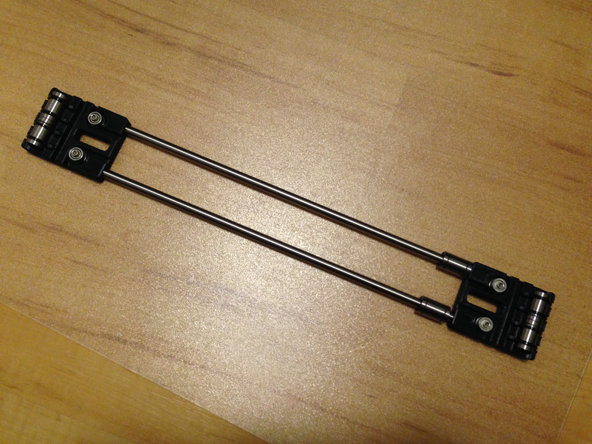
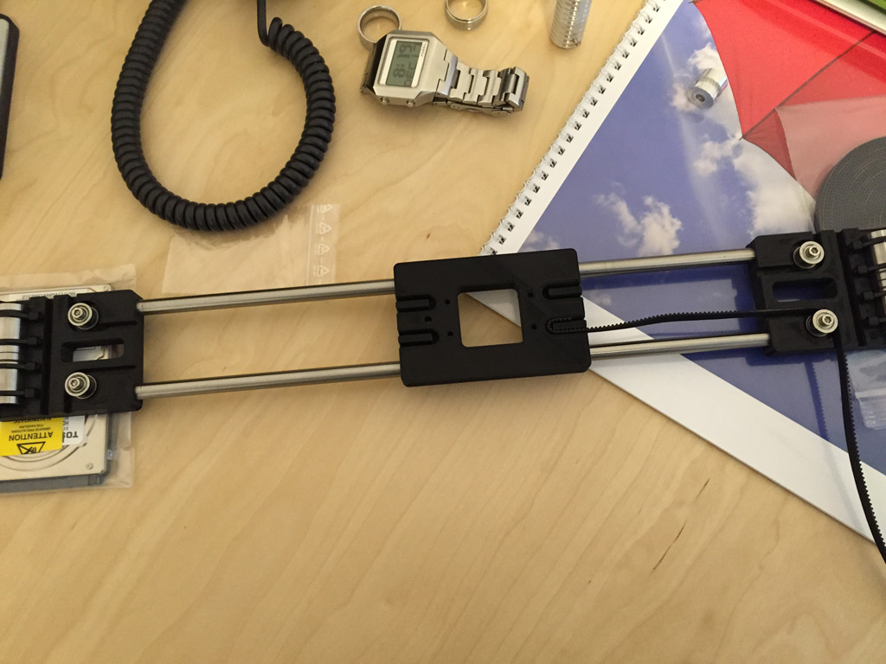
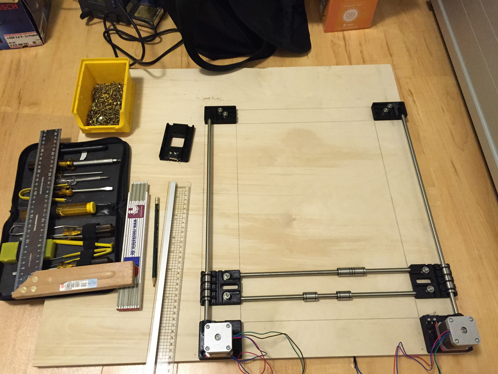
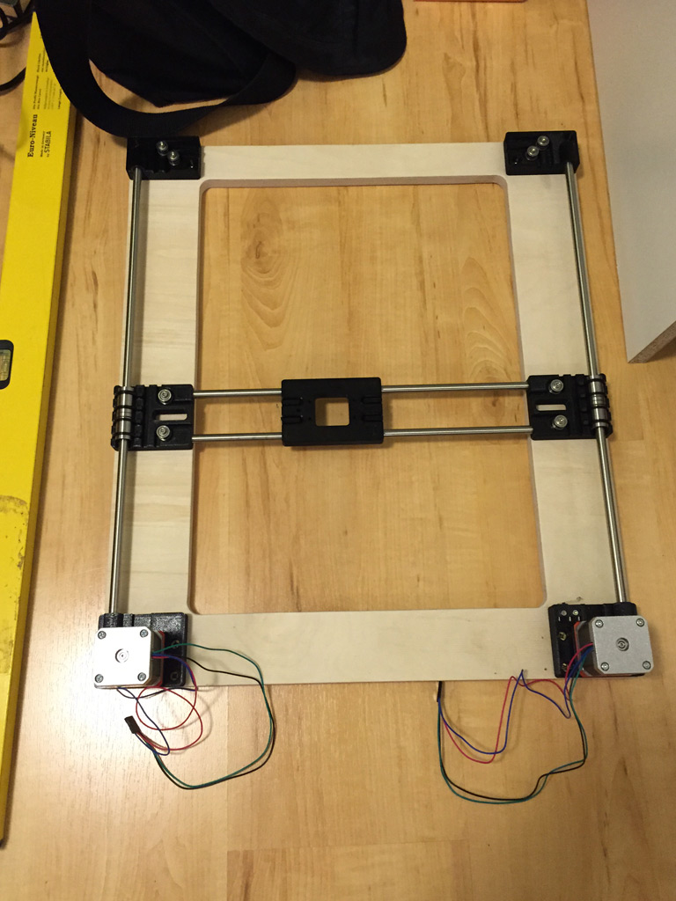

### CoreBeam assembly

Having printed all plastic parts and cut all smooth rods to length, assembling the CoreBeam laser cutter isn't that hard. I made some photos over the build process to show several milestones, but some photos of details are missing and are only mentioned in the text.

### X-Axis
1. Take the short smooth rods and slide two LM8UU linear bearings on each of it.
2. Put the x stage onto the four bearings. It will snap on easily.
3. Slide the y stages onto the ends of the smooth rods.
4. Insert another two LM8UU linear bearings into each y stage and secure them with zip ties. Place the zip tie ends on top of each y stage to avoid later problems.
5. Mount four 623zz bearings on each y stage as pulley. Insert a M3 spacer on the mounting hole. Place two bearings with the brim on the outside on top and secure them with a M3 screw. Use a M3 hexnut in the hexnut trap on the bottom of the stage.

### Y-Axis
1. Mount the NEMA17 stepper motors with the GT2 pulleys attached on their correlating plastic parts, the wires pointing to the inner side. Maybe you need to insert a spacer, if the shaft of your motor is too long and will exceed the height of the plastic mount.
2. Mount four 623zz bearings on each top corner as pulley. Insert a M3 spacer on the mounting hole. Place two bearings with the brim on the outside on top and secure them with a M3 screw. Use a M3 hexnut in the hexnut trap on the bottom of the stage.
3. Insert the long smooth rods into the bottom corner with your stepper motors. Slide the previous built x-axis onto it. Now attach the top corners.

### Wooden frame
1. Place the linear-rails onto the wood. Use pencil and ruler to mark the dimensions of your build and the holes for the wood screws.
2. Use a drill to cut holes in each inner corner. I used a 20mm diameter forstner drill to make nice looking rounded corners.
3. Cut the wood with jig saw too size.
4. Use a small drill to pre-drill the mounting holes on the frame.
5. Mount the corners onto the frame using two wood screws on each corner.

